# Grip Linux Ubuntu 22.04 Guide

## 🐧 Basic Linux Commands Cheat Sheet

| Command | Description |
|---------|-------------|
| `ls` | List directory contents |
| `pwd` | Print the current working directory |
| `cd` | Change directories |
| `mkdir` | Create new directories |
| `touch` | Create an empty file |
| `cp` | Copy files or directories |
| `mv` | Move or rename files and directories |
| `rm` | Remove files or directories |
| `ln` | Create symbolic (soft) links to files or directories |
| `cat` | Display the contents of a file |
| `head` | Show the first N lines of a file |
| `tail` | Show the last N lines of a file |
| `echo` | Print text to the terminal or a file |
| `chmod` | Change file permissions |
| `chown` | Change file owner or group |
| `zip` | Compress files into a .zip archive |
| `unzip` | Extract files from a .zip archive |
| `whoami` | Display the current username |
| `passwd` | Change the password for a user |
| `uname` | Show system information |
| `df` | Report disk space usage of file systems |
| `ifconfig` | Show IP address and network interfaces |
| `mount` | Mount a filesystem |
| `clear` | Clear the terminal screen |
| `whatis` | Show a brief description of a command |
| `sudo` | Execute a command with superuser privileges |
| `ufw` | Uncomplicated Firewall (manage firewall rules) |
| `ssh` | Connect to remote machines securely via SSH |
| `service` | Start, stop, or restart system services |

---

## 🛠️ Server Installation

### Step-by-Step Visual Guide

#### 1. First Boot USB with ISO file of `Ubuntu Server 22.04`

#### 2. In Boot Mode select `Try or Install Ubuntu Server`
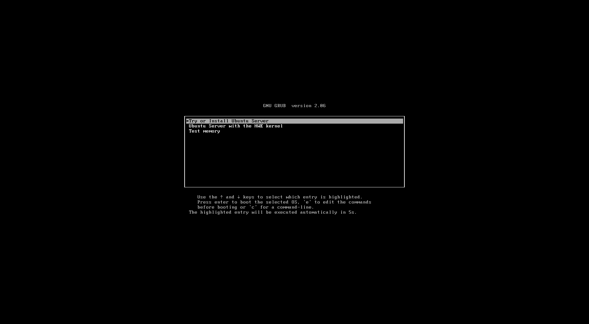

#### 3. Select Language & Then Enter
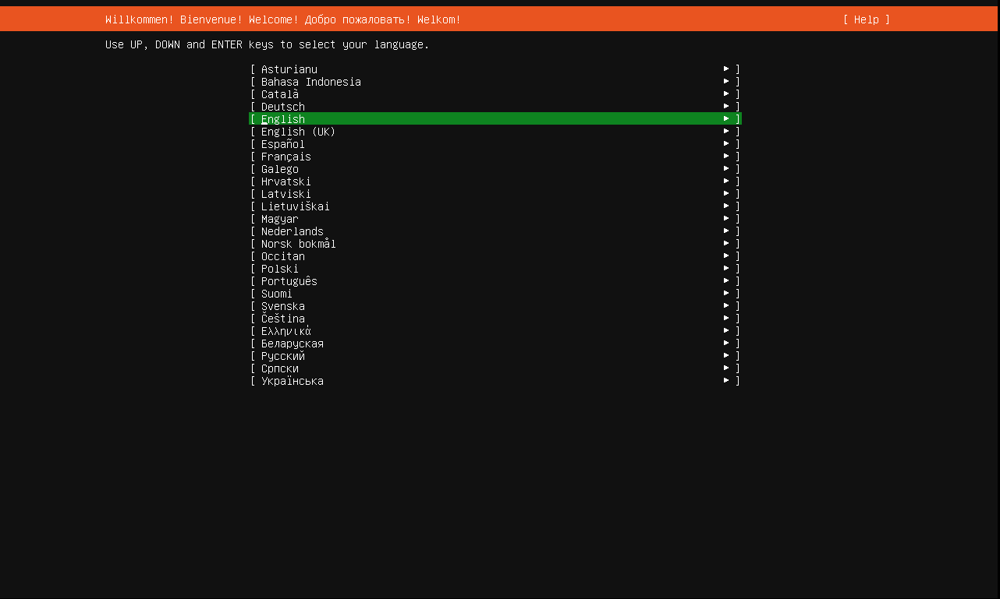

#### 4. If show then `Continue without updating`
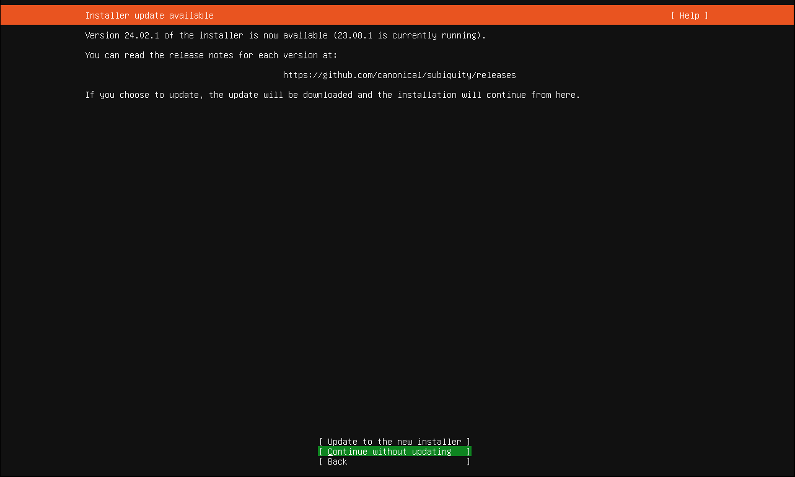

#### 5. `Done`
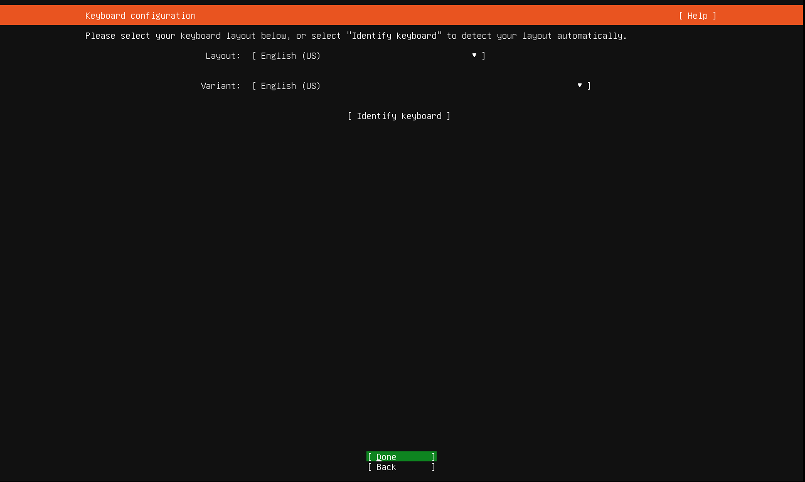

#### 6. Continue with `Ubuntu Server` checked
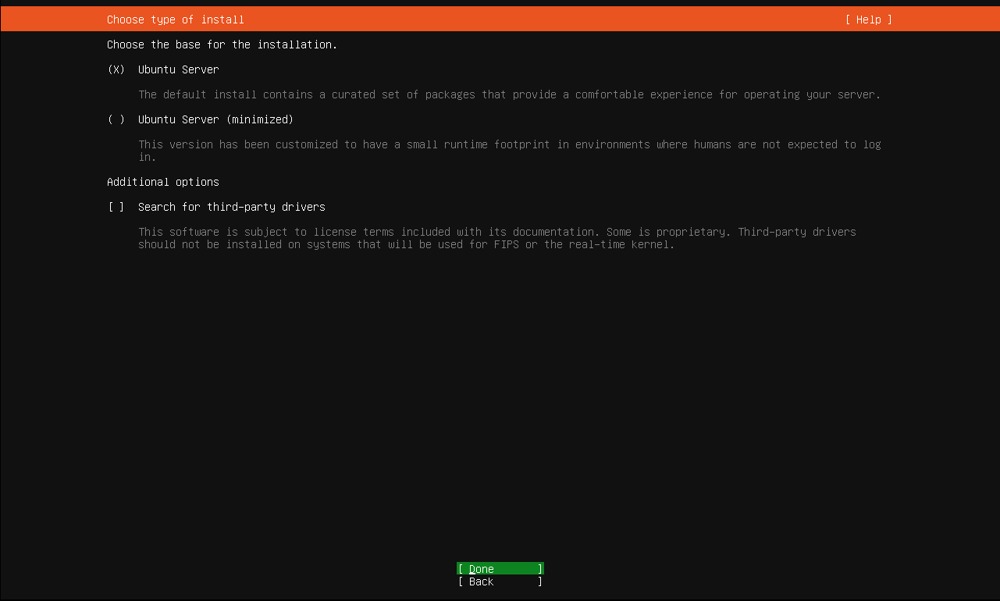

#### 7. You can `Set Static IP` here OR Continue `Done`
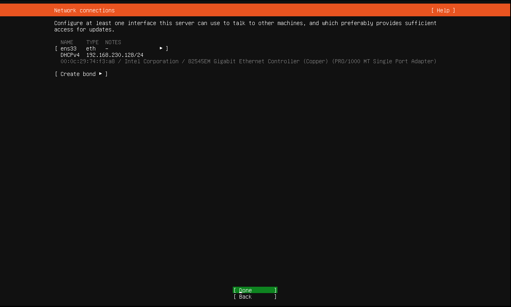

#### 8. `Done`


#### 9. Wait until the image tests complete & Then `Done`
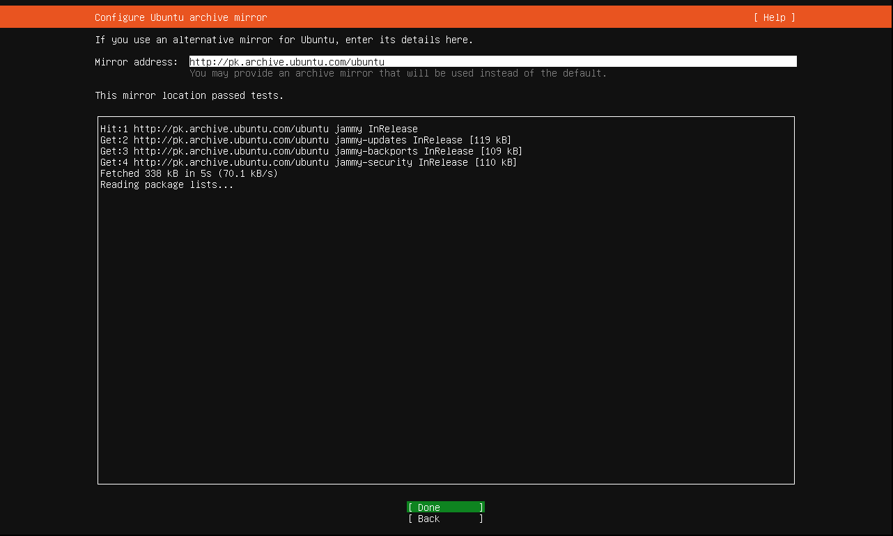

#### 10. Just check mark the `Use an entire disk` & `Done`
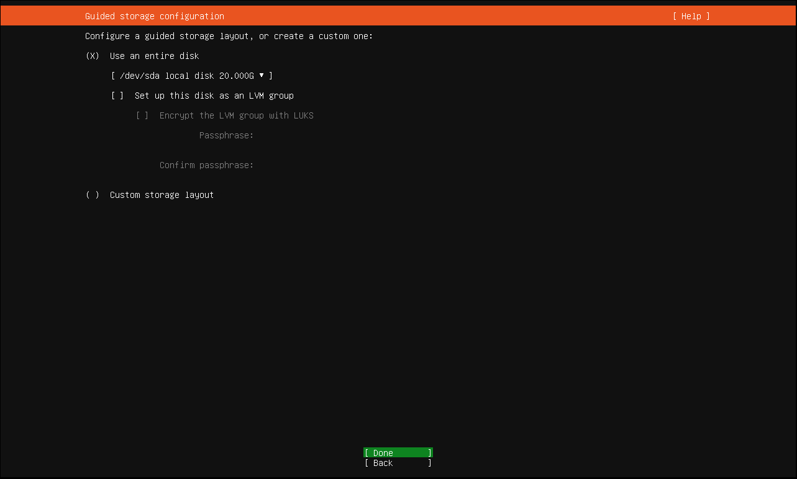

#### 11. Review the Partitions & Then `Done`
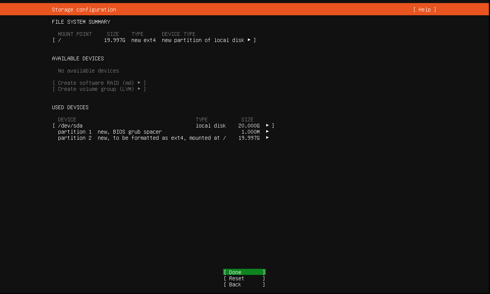

#### 12. `Continue`
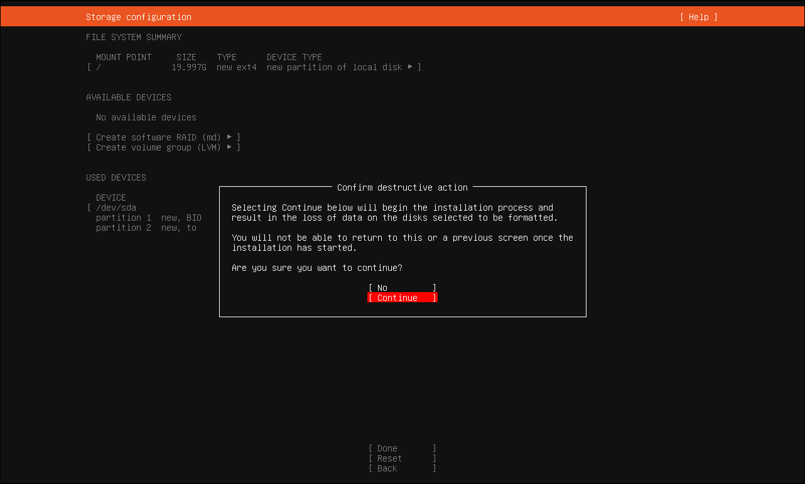

#### 14. Fill the information & Then `Done`
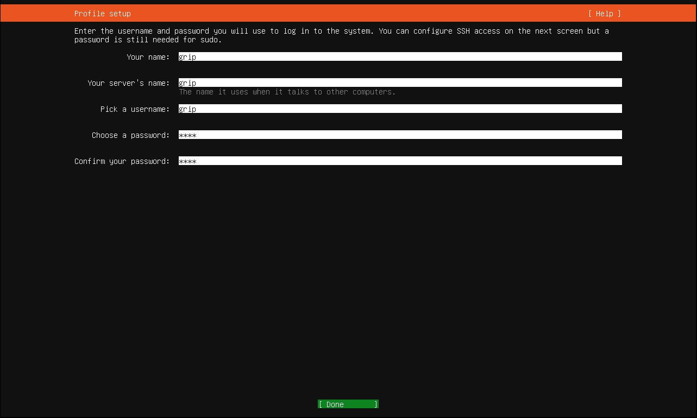

#### 15. Keep the `skip for now` check & `Continue`
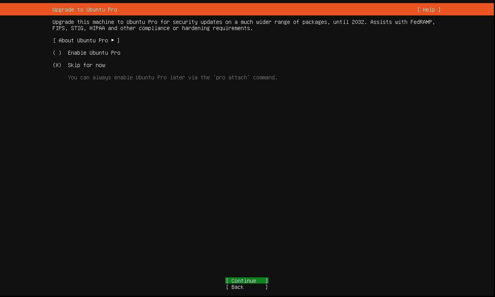

#### 16. Check mark the `Install OpenSSH Server` & Then `Done`
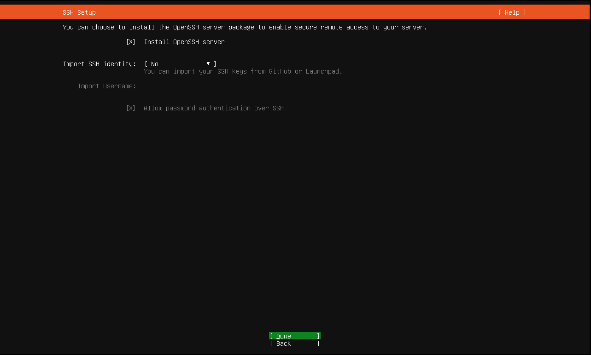

#### 17. `Done`
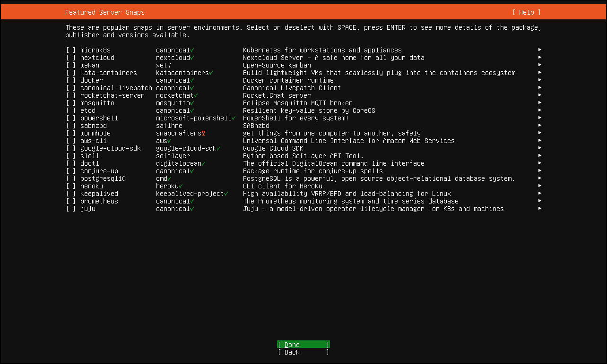

#### 18. Now Wait Until the Installation complete & Then on Complete `Reboot Now`
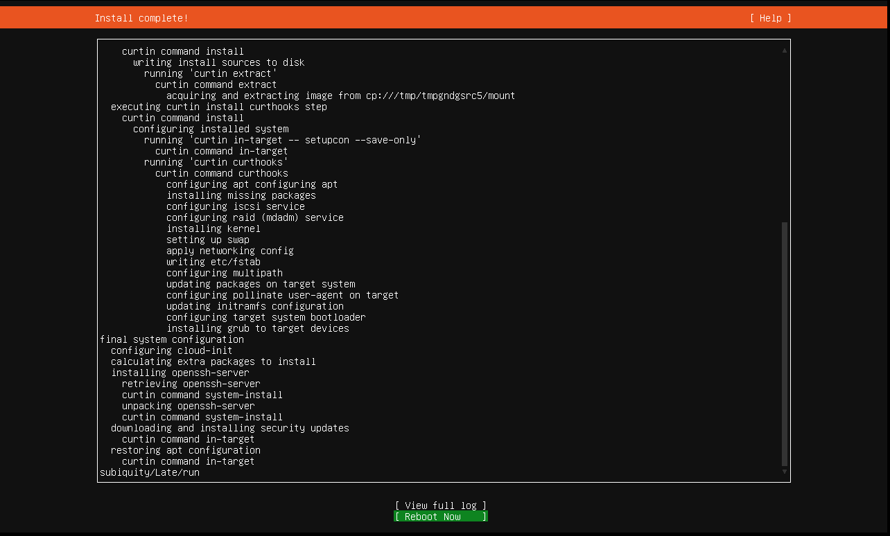

#### 19. Now Remove the USB & Press `Enter` 
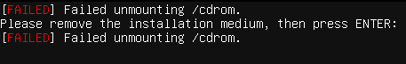

#### 20. Finally you can login with `info` 
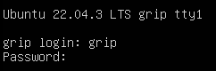

## Basic Settings
### Update the packages
```
sudo apt update
sudo apt upgrade
sudo apt install net-tools
```

### Firewall Setting
##### Enable firewall & Then allow SSH to connect it remotely
```
sudo ufw enable
sudo ufw allow "OpenSSH"
```
##### 

## MSSQL Server Installation
#### Script For Installation of SQL 2022 for `Ubuntu 22.04`
```
#!/bin/bash

# Update packages & install curl and other essentials
echo 'Updating packages & installing curl...'
sudo apt update
sudo apt install -y curl gnupg apt-transport-https

echo 'Now Installing SQL Server...'

# Step 1: Import Microsoft GPG key
curl -fsSL https://packages.microsoft.com/keys/microsoft.asc | sudo gpg --dearmor -o /usr/share/keyrings/microsoft-prod.gpg

# Step 2: Add repository (extra optional GPG step)
curl https://packages.microsoft.com/keys/microsoft.asc | sudo tee /etc/apt/trusted.gpg.d/microsoft.asc

# Step 3: Add SQL Server repository for Ubuntu 22.04
curl -fsSL https://packages.microsoft.com/config/ubuntu/22.04/mssql-server-preview.list | sudo tee /etc/apt/sources.list.d/mssql-server-preview.list

# Step 4: Install SQL Server
echo 'Updating package list and installing SQL Server...'
sudo apt-get update
sudo apt-get install -y mssql-server

# Step 5: SQL Server setup with auto inputs
echo 'Starting SQL Server configuration...'

# Set SA Password
SA_PASSWORD='Your@StrongPassword'

sudo MSSQL_PID=Developer ACCEPT_EULA=Y MSSQL_SA_PASSWORD="$SA_PASSWORD" /opt/mssql/bin/mssql-conf setup <<EOF
7
Yes
$SA_PASSWORD
Yes
No
EOF

# Step 6: Change SQL Server TCP Port to PortNumber
SQL_PORT= Number
echo ''
echo 'Changing SQL Server port'
sudo /opt/mssql/bin/mssql-conf set network.tcpport $SQL_PORT

# Step 7: Restart SQL Server to apply port change
echo ''
echo 'Restarting SQL Server...'
sudo systemctl restart mssql-server

# Step 8: Enable SQL Server Agent
echo ''
echo 'Enabling SQL Server Agent...'
sudo /opt/mssql/bin/mssql-conf set sqlagent.enabled true

# Step 9: Restart SQL Server again for Agent activation
echo ''
echo 'Restarting SQL Server again...'
sudo systemctl restart mssql-server

# Step 10: Check final status
echo ''
echo 'Checking final SQL Server status...'
systemctl status mssql-server --no-pager

echo ''
echo '✅ SQL Server installation, port change, and SQL Agent enable completed.'
echo "✅ SA password: $SA_PASSWORD"
echo ''
echo "✅ SQL Server is now listening on port $SQL_PORT"
echo "✅ SQL Agent is enabled."
```

#### Note
##### If any issue occure during installation OR Want any Other SQL version 
Please visit the MSSQL Official Site:  [SQL Server on Linux - Microsoft Docs](https://learn.microsoft.com/en-us/sql/linux/sql-server-linux-setup)

## PM2 Service Installation
#### Script For Installation of PM2 Service & Node for `Ubuntu 22.04`
```
#!/bin/bash

# Update package lists and upgrade existing packages
sudo apt update && sudo apt upgrade -y

# Install essential dependencies
sudo apt install -y curl build-essential

# Add NodeSource repository for the latest LTS version of Node.js
curl -fsSL https://deb.nodesource.com/setup_lts.x | sudo -E bash -

# Install Node.js and npm  
sudo apt install -y nodejs

# Verify installations
node -v
npm -v

# Install PM2 globally using npm
sudo npm install -g pm2

# Verify PM2 installation
pm2 -v

echo "✅ Node.js and PM2 have been installed successfully."
```
#### Service Basic Commands
```
pm2 status                      # Show status of all applications
pm2 start app.js --name AppName # Start app.js with a custom name
pm2 list                        # List all running PM2 applications
pm2 stop <name|id>              # Stop an app by name or ID
pm2 reload <name|id>            # Reload an app without downtime
pm2 restart <name|id>           # Restart an app by name or ID
pm2 delete <name|id>            # Delete an app from PM2
pm2 logs <name|id>              # Show logs for a specific app
pm2 logs                        # Show logs for all apps
pm2 flush <name|id>             # Clear logs for a specific app
pm2 flush                       # Clear logs for all apps
pm2 save -f                     # Save the current process list for startup
pm2 startup                     # run this to ensure apps restart after reboot
pm2 monit                       # Show monitoring dashboard
```

## Nginx Hosting Service
### Installation
```
sudo apt update
sudo apt install nginx -y
```
#### Service Basic Commands
```
sudo systemctl status nginx     # Check the current status of Nginx
sudo systemctl start nginx      # Start Nginx service
sudo systemctl stop nginx       # Stop Nginx service
sudo systemctl reload nginx     # Reload Nginx configuration without downtime
sudo systemctl restart nginx    # Restart Nginx service
```


## Password-less SSH Connection Setup

#### 1. Generate SSH Key (on Local Machine)

Run the following command to generate a new SSH key pair:

```
ssh-keygen -t ed25519 -C "your_email@example.com"
```

This creates a secure key pair and stores it by default in `~/.ssh/id_ed25519` (private key) and `~/.ssh/id_ed25519.pub` (public key).  
You may set a passphrase or leave it empty for no passphrase.

#### 2. Copy the Public Key to the Ubuntu Server

Use the following command to send your public key to the server:

```
cat ~/.ssh/id_ed25519.pub | ssh username@your_server_ip 'mkdir -p ~/.ssh && cat >> ~/.ssh/authorized_keys && chmod 700 ~/.ssh && chmod 600 ~/.ssh/authorized_keys'
```

Replace `username` with your actual server username and `your_server_ip` with your server’s IP address.  
This ensures your `.ssh` folder and `authorized_keys` file are correctly set up with secure permissions.

#### 3. Test the SSH Connection

Now try logging into your server:

```
ssh username@your_server_ip
```

If everything is set up correctly, you should **log in without being asked for a password**.


#### Optional: Disable Password Authentication on the Server (For Security)

> Only do this **after confirming** SSH key login works.

1. Open the SSH config file on the server:

```
sudo nano /etc/ssh/sshd_config
```

2. Find and modify the following lines:

```
PasswordAuthentication no
PermitRootLogin no
```

3. Save the file and restart SSH:

```
sudo systemctl restart ssh
```

#### Notes

- The ED25519 algorithm is faster and more secure than RSA for most modern systems.
- Keep your private key (`~/.ssh/id_ed25519`) safe and never share it.
- Use `ssh-add` to load your key into the SSH agent if needed:
  
  ```
  ssh-add ~/.ssh/id_ed25519
  ```
####  ✅ Done!
You now have secure, password-less SSH access to your server.

