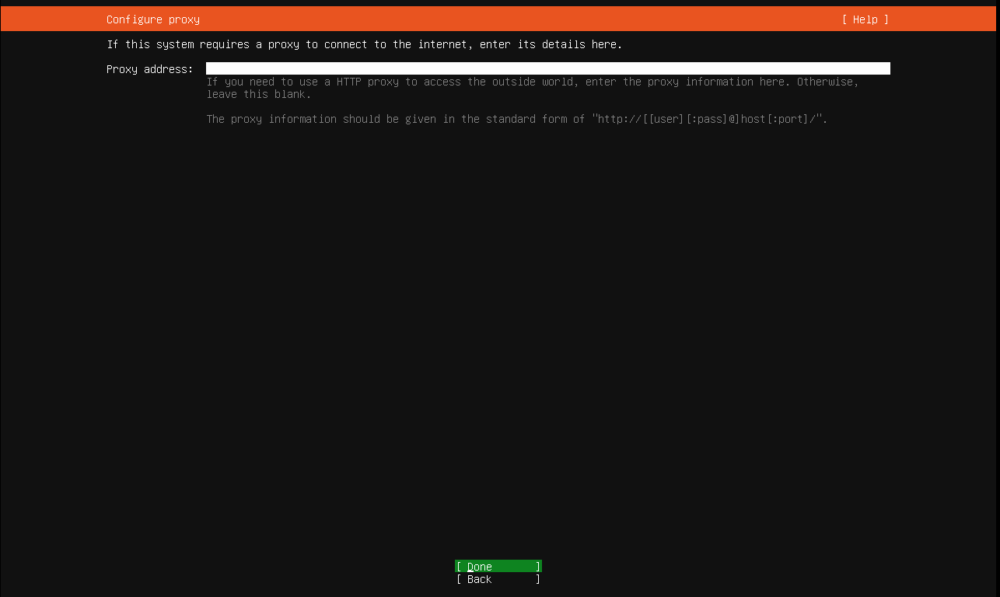

# Grip Linux Ubuntu 22.04 Guide

## 🐧 Basic Linux Commands Cheat Sheet

| Command | Description |
|---------|-------------|
| `ls` | List directory contents |
| `pwd` | Print the current working directory |
| `cd` | Change directories |
| `mkdir` | Create new directories |
| `touch` | Create an empty file |
| `cp` | Copy files or directories |
| `mv` | Move or rename files and directories |
| `rm` | Remove files or directories |
| `ln` | Create symbolic (soft) links to files or directories |
| `cat` | Display the contents of a file |
| `head` | Show the first N lines of a file |
| `tail` | Show the last N lines of a file |
| `echo` | Print text to the terminal or a file |
| `chmod` | Change file permissions |
| `chown` | Change file owner or group |
| `zip` | Compress files into a .zip archive |
| `unzip` | Extract files from a .zip archive |
| `whoami` | Display the current username |
| `passwd` | Change the password for a user |
| `uname` | Show system information |
| `df` | Report disk space usage of file systems |
| `ifconfig` | Show IP address and network interfaces |
| `mount` | Mount a filesystem |
| `clear` | Clear the terminal screen |
| `whatis` | Show a brief description of a command |
| `sudo` | Execute a command with superuser privileges |
| `ufw` | Uncomplicated Firewall (manage firewall rules) |
| `ssh` | Connect to remote machines securely via SSH |
| `service` | Start, stop, or restart system services |

---

## 🛠️ Server Installation

### Step-by-Step Visual Guide

#### 1. First Boot USB with ISO file of `Ubuntu Server 22.04`

#### 2. In Boot Mode select `Try or Install Ubuntu Server`

#### 3. Select Language & Then Enter

#### 4. If show then `Continue without updating`

#### 5. `Done`

#### 6. Continue with `Ubuntu Server` checked

#### 7. You can `Set Static IP` here OR Continue `Done`

#### 8. `Done`

#### 9. Wait until the image tests complete & Then `Done`

#### 10. Just check mark the `Use an entire disk` & `Done`

#### 11. Review the Partitions & Then `Done`

#### 12. `Continue`

#### 14. Fill the information & Then `Done`

#### 15. Keep the `skip for now` check & `Continue`

#### 16. Check mark the `Install OpenSSH Server` & Then `Done`

#### 17. `Done`

#### 18. Now Wait Until the Installation complete & Then on Complete `Reboot Now`

#### 19. Now Remove the USB & Press `Enter` 

#### 20. Finally you can login with `info` 

